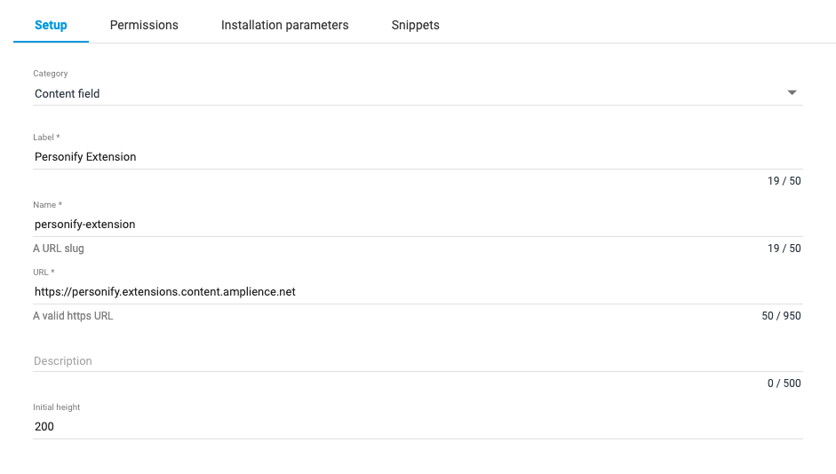

[](https://amplience.com/dynamic-content)

# dc-extension-personify


This UI extension integrates with [Personify XP](https://personifyxp.com/)'s API and can be configured to allow content to be categorized by behaviors or tags and to display a content relevance score. Sample schemas and content types are available in the `sample-content` directory to help get you started.

## Key features:

- Classify content with Personify XP behaviors or tags.
- View an overall 'Content relevance' score to see what percentage of your website's audience the content is relevant to.
- View suggestions on how to make content relevant to a wider section of your audience.
- View relevance scores for selected behaviors and tags.

## Parameters in schema

Used in the params object of your schema properties when adding the extension to your schema. 

```json
{
  "type": "{coverage|criteria}"
}
```
- `type`: Set to `coverage` to display 'Content relevance' scores or `criteria` to allow tag and behavior selection.

## How to install

### Register extension

This extension needs to be [registered](https://amplience.com/docs/development/registeringextensions.html) with a Hub within the Dynamic Content application (Development -> Extensions), for it to be available within that Hub.



#### Settings

- `Category:` Content Field.
- `Label:` Personify XP extension _(this will appear under the 'add extension' dropdown in the schema editor)_.
- `Name`: personify-extension _(needs to be unique within the Hub)_.
- `URL`: [https://dc-extension-personify.extensions.content.amplience.net](https://dc-extension-personify.extensions.content.amplience.net) (TBC).
- `Description`: Personify XP extension _(can be left blank if you wish)_.
- `Initial height`: 200.

**Note:** You can use our deployed version of this extension (builds from the 'main' branch) -

[dc-extension-personify.extensions.content.amplience.net](https://dc-extension-personify.extensions.content.amplience.net) (TBC).

_As this is an open source project you're welcome to host your own fork of the project. You can use any standard static hosting service (Netlify, Amplify, Vercel, etc.) if you wish._

#### Installation parameters

The following installation parameter must be added in the `Installation parameters` section of the extension registration screen:

```json
{
  "apiUrl": "{https://service.url}",
}
```

- `apiUrl`: The Personify XP service URL, provided to you by Personify XP support.

### Create schemas and register content types

**Import using our dc-cli tool (recommended)**

You can import the schemas and content types to your hub using the [Dynamic Content CLI](https://github.com/amplience/dc-cli/blob/master/IMPORT_USAGE.md).

Install and configure the CLI tool and import the content types and schemas by running the following commands in the project direcotry:

```bash
npm i
npx dc-cli --clientId <YOUR_CLIENT_ID> --clientSecret <YOUR_CLIENT_SECRET> --hubId <YOUR_HUB_ID> configure
npm run sync
```

**Notes:**

- `npm run sync` imports the content type schemas and content types as well as synchronizing any content type changes to your content items.
- the [CLI definitions](https://github.com/amplience/dc-extension-personify/tree/main/sample-content) assume that your hub contains a repository called 'content'. If your repository name is different you will need to update the definitions.

**Import manually**

- Log in, go to development and create a new schema.
- Enter [https://personify.extensions.content.amplience.net/targeted-content.json](https://personify.extensions.content.amplience.net/targeted-content.json) as your ID _(feel free to use another ID)_.
- Paste the contents of `sample-content/schemas/schemas/targeted-content-schema.json` _(if you entered a custom schema id, ensure you update the "$id" property to match)_.
- Click 'Save and register as content type'.
- Repeat the process with `sample-content/schemas/schemas/hero-banner.json`.

## How to run locally

- `npm i`
- `HTTPS=true npm start`
- Visit `https://localhost:3000` in the browser and accept the security risk.
- Follow the steps above on how to register the extension and use `https://localhost:3000` as the URL.
- Follow the steps above on how to assign an extension to the schema.

### Running tests

`npm run test` Launches the test runner in the interactive watch mode.

### Bulding the extension

`npm run build` Builds the app for production to the `build` folder.
